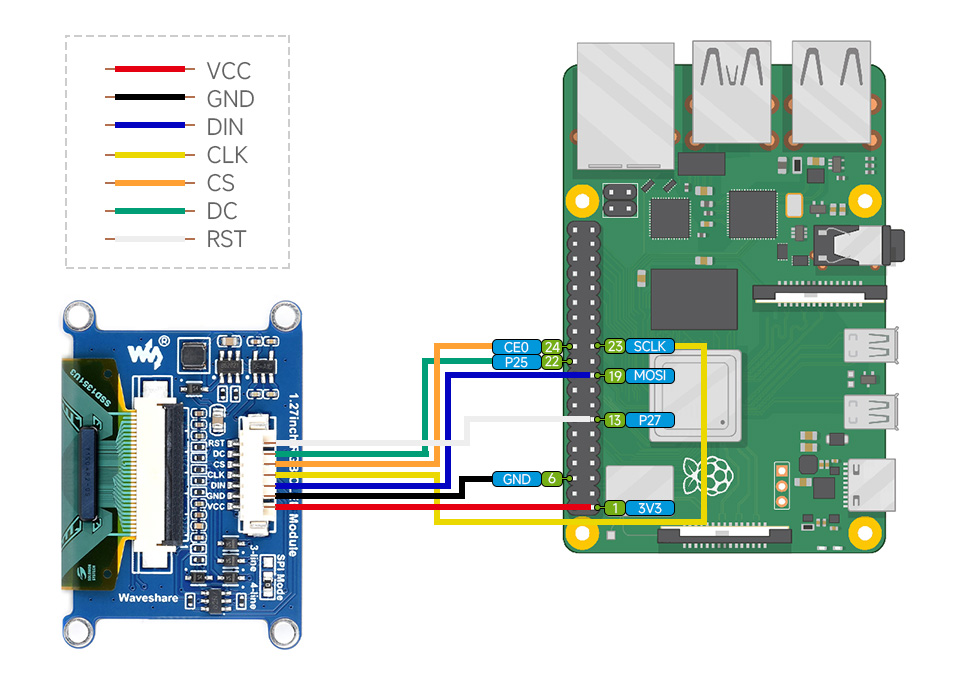
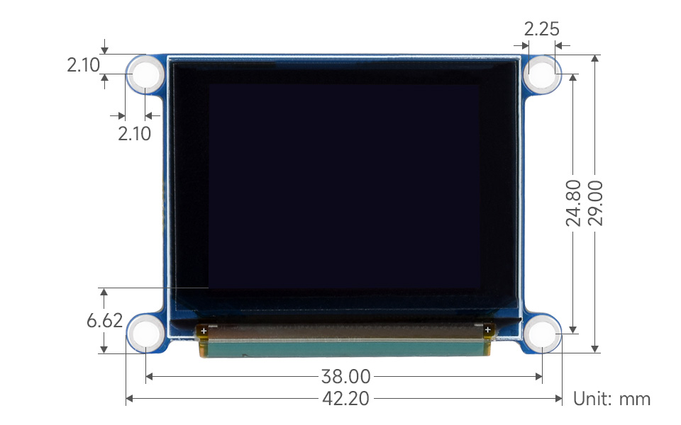

| Pin  | Description                          |
|------|--------------------------------------|
| RES  | Reset, low active                    |
| DC   | Data/Command selection (high for data, low for command) |
| CS   | Chip selection, low active           |
| CLK  | Clock input                          |
| DIN  | Data input                           |
| GND  | Ground                               |
| VCC  | Power (3.3V / 5V input)              |

